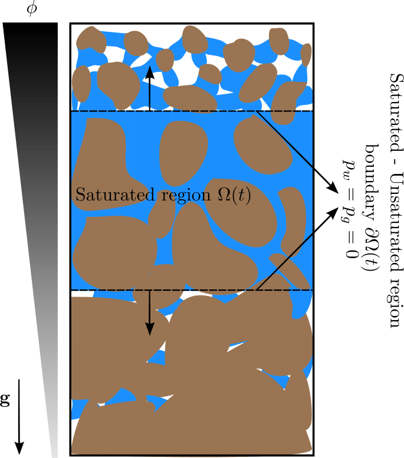

# Gravity driven infiltration with the development of a saturated region
## Authors
- Mohammad Afzal Shadab
- Marc Andre Hesse

## Affiliation
Oden Institute for Computational Engineering and Sciences / Jackson School of Geosciences / University of Texas Institute for Geophysics
The University of Texas at Austin

## 4-line Summary
Hyperbolic (kinematic wave) analysis in infiltration theory is a technique to estimate the ponding time and runoff estimates in low-textured soils. The proposed theory can be applied to general soil profiles. The codes provide the analytical solutions for infiltration in soils with two-layer, exponential and power-law porosity decay profiles. The results have been validated with numerical solver and Hydrus simulations.

## Citation
Shadab, M.A. and Hesse, M.A., 202X. Gravity driven infiltration with the development of a saturated region, Water Resources Research (submitted).

## Getting Started

### Overview

The codes correspond to the figures given in the research paper. Understanding the controls on the infiltration of precipitation into soil is an important problem in hydrology and its representation in heterogeneous media is still challenging. Here we investigate the reduction of infiltration by the development of a saturated region due to the downward decrease in porosity and permeability. The formation of a saturated region leads to the back-filling of the pore space above, so that the saturated region expands both upward and downward. Practically this problem in important because soil porosity commonly declines downward and leads to a reduction of infiltration. We consider gravity-driven infiltration using the hyperbolic limit of Richards' equation. The analytical results for all soil profiles are validated with numerical simulations and moreover two-layered profile is also validated with Hydrus-1D results. This approach helps analyze infiltration in more general low-textured soil profiles at different rainfall rates and provides ponding time and runoff estimates. Lastly, solving the hyperbolic-elliptic problem is also computationally more efficient than solving the full Richards' equation in the limit of negligible capillary forces, because the non-linearity can be integrated explicitly. 

Key points of the present work:
1. Derived relations for infiltration due to transitional rainfall in a dry soil with general porosity decay with depth
2. Integrated the fully-saturated elliptic region inside an otherwise unsaturated hyperbolic region

### Dependences

hyperbolic-infiltration-theory requires the following packages to function:
- [Python](https://www.python.org/) version 3.5+
- [Numpy](http://www.numpy.org/) >= 1.16
- [scipy](https://www.scipy.org/) >=1.5
- [matplotlib](https://matplotlib.org/) >=3.3.4

### Quick Usage
After cloning the repository and installing the required libraries, run the python files corresponding to the figure numbers as given in the paper. Codes can be run either directly or on an IDE such as Anaconda Spyder. `supporting_tools.py` is the file containing the auxillaries. Figure 14 and 15 correspond to a Hydrus 1D file for infiltration in two-layered soil.

### Non-dimensionalization
The depth coordinate $`z`$ is scaled with characteristic length $`z_0`$, time is scaled with characteristic time $`z_0/f_c`$ and infiltration rate $`I(t)`$ (or volumetric flux) is scaled with the infiltration capacity $`f_c`$. Therefore, the dimensionless variables are $`z'=z/z_0`$, $`t'=tf_c/z_0`$, and $`f'=I(t)/f_c`$.
